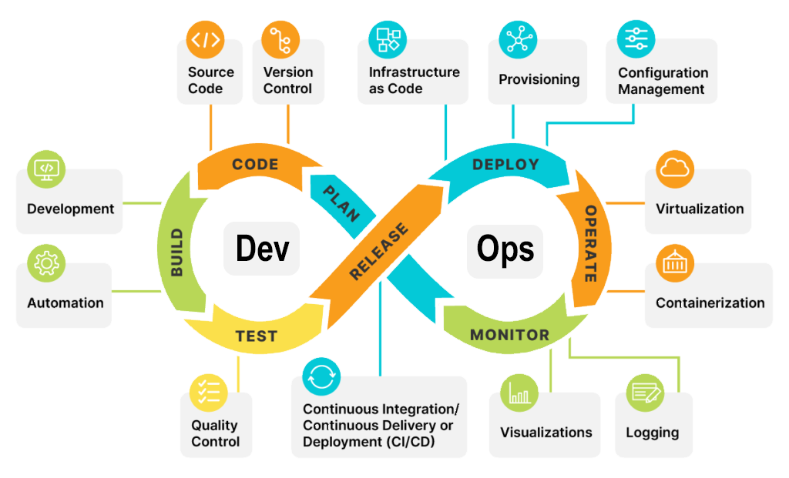
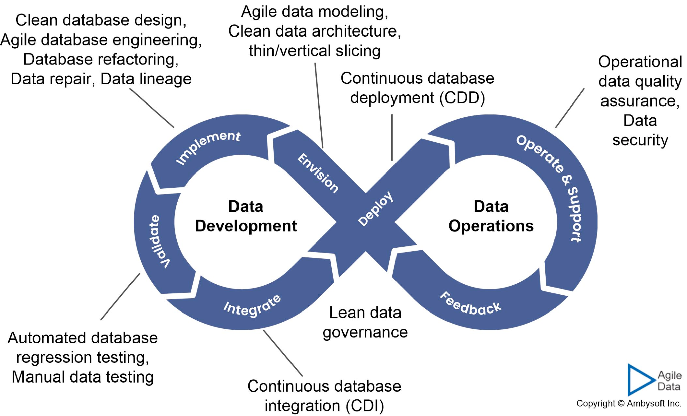

# DevOps vs DataOps
### DevOps
Focussed on high quality, consistent frameworks for feature development in software engineering.

### DataOps
An applied framework for managing data debt through a mix of customized Ops practices, and involves additional work around integration, abstraction, and automation in data layers.

*Courtesy of Ambisoft Inc.*